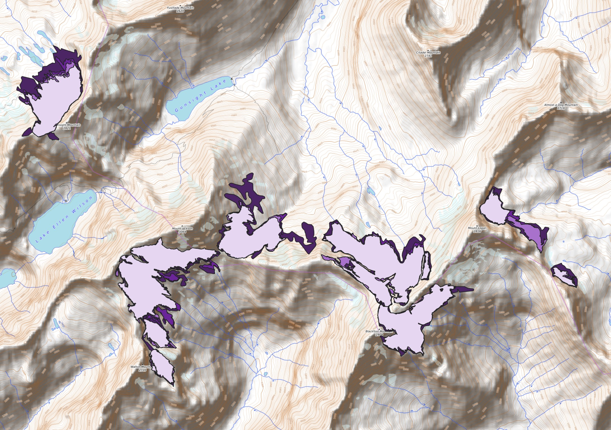

## Portfolio

---

### Projects 

#### Changes in Glaciers at Glacier National Park from 1966 through 2015

---

#### NJDOH 2019 Animal Shelter Data

---

### National Park After Dark Podcast Story Map

---

#### Kincade Fire Burn Area in California: Before, After, and dNBR

---
[Exploring Rehabilitated Sea Turtle Tracking](pdf/sea_turtle_report_gis5653.pdf)

In this project I used Python to explore sea turtle tracking data in ArcMap.

---

### Category Name 2

- [Project 1 Title](http://example.com/)
- [Project 2 Title](http://example.com/)
- [Project 3 Title](http://example.com/)
- [Project 4 Title](http://example.com/)
- [Project 5 Title](http://example.com/)

---

---

Page template forked from <a href="https://github.com/evanca/quick-portfolio">evanca</a>

<!-- Remove above link if you don't want to attibute -->
